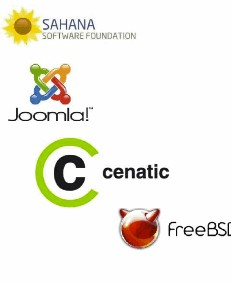

# UT1.1 Introducción a los sistemas informáticos: software 

## El software

```note
El software es el conjunto de instrucciones y programas, parte intangible, que utiliza un ordenador o computadora para funcionar y que se almacena en su memoria.
```

>   

Comúnmente se utiliza este término para referirse de una forma muy genérica a los programas de un dispositivo informático, la parte **lógica** de un ordenador.

Para que un ordenador funcione necesita información o **datos** con los que trabajar. Esta información es de varios tipos dependiendo de su función. El ordenador puede servir para procesar información en forma de datos, los cuales pueden ser textos, imágenes, datos de sensores, hojas de cálculo,
tablas de una base datos, etc.

1.  **Datos de entrada**: Los que se suministran al ordenador desde los periféricos de entrada (teclado, ratón, escáner) o soportes como disocs (HDDs, DVDs, etc). Forman parte de la primera fase del tratamiento de la información denominada **entrada**.
    
2.  **Datos intermedios:** Son los que se obtienen en el tratamiento de la información denominada **proceso**.
    
3.  **Datos de salida**: se denominan también resultados del proceso de tratamiento: **salida**.

Para que los componentes electrónicos de un ordenador sean capaces de funcionar y realizar un proceso determinado, es necesario ejecutar un conjunto de órdenes o instrucciones.

>   Se denomina **programa** al conjunto de **instrucciones** ordenadas y adecuadas para llevar a cabo un determinado proceso.

>   El **software básico** para hacer funcionar cualquier ordenador se denomina sistema operativo y es lo que estudiaremos en este módulo junto con diversos programas.

>   El **sistema operativo** es el componente software de un sistema informático capaz de hacer que los **programas** (**software**) procesen información (**datos**) sobre los componentes electrónicos de un ordenador o sistema informático (**hardware**).


## Clasificación del software

El software se suele clasificar de forma típica en tres tipos según su función como veremos a continuación:

- Software del sistema

- Software de programación

- Software de aplicación


### Software del sistema (base)

```note
El software de sistema también llamado software de base es el conjunto de programas que sirven para interactuar con el sistema informático, confiriendo control sobre todo el hardware, además de dar soporte a otros programas.
```

Este software se divide en:

-   Sistemas Operativos

-   Controladores de dispositivos (drivers)

-   BIOS/UEFI

-   Hipervisores de Máquinas Virtuales

-   Gestores de arranque

-   Otros programas (como *OpenGL, directX*..)

### Software de programación

```note
El software de programación es un conjunto de herramientas software que permiten al desarrollador informático escribir programas usando diferentes alternativas y lenguajes de programación (muchos de ellos específicos para cada uno de ellos)
```

Este tipo de software incluye principalmente:

-   Editores de código

-   Compiladores y depuradores de código

-   Intérpretes o ensambladores

-   Entornos de desarrollo integrado (IDEs)


### Software de aplicación

```note
El software de aplicación son los programas diseñados para los usuarios para la realización de tareas específicas en los ordenadores o dispositivos para los que han sido diseñados.
```

Este software se podría dividir en:

-   Aplicaciones de negocio.

-   Aplicaciones ofimáticas.

-   Aplicaciones educativas.

-   Aplicaciones de entretenimiento.

-   Aplicaciones personales.

### Otras clasificaciones

El software también se suele clasificar siguiendo el siguiente esquema:


## Licencias de software

Para cada uno de estos tres tipos de software vistos anteriormente, es necesario distinguir entre software libre o software, dependiendo de las **licencias** y permisos para su uso:

-   **Software libre** es el que otorga libertad de uso, copia y distribución a los usuarios. Su código puede ser totalmente abierto o estar sometido a ciertas normas según la licencia asociada concreta a ese programa.
    
-   **Software de propietario** es aquel cuyas condiciones de uso, copia y  distribución están sometidas a normas o restricciones. Su código fuente es cerrado, es decir, no está disponible para el usuario (el propietario puede mostrarlo, pero esto no implica que pase a ser software libre en  cuanto a su uso).


>   Una **licencia de software** es un contrato entre el licenciante (autor/titular de los derechos de explotación/distribuidor) y el licenciatario del programa informático (usuario consumidor/usuario profesional o empresa), para utilizar el software cumpliendo una serie de términos y condiciones establecidas en sus cláusulas.

Cuando compramos o bajamos de Internet un programa, al instalarlo solemos aceptar sin leer (*mala costumbre*) un contrato que especifica el tipo de **Licencia** de uso del software, en inglés *EULA *o *End User License Agreement*: licencia por la cual el uso de un producto sólo está permitido para un único usuario (el comprador). Es un acuerdo unilateral puesto que el usuario no tiene más opción que aceptar o rechazar el contenido del mismo.

Aunque se confunden, software de **código abierto** y el **software libre** no son exactamente lo mismo debido a diferencias sutiles de concepto.

### Software libre (GNU)

```note
El proyecto GNU fue iniciado en 1984 por Richard Stallman y fundó la Free Software Foundation sin ánimo de lucro.
```

Se fundamenta en la moral y exige la libertad absoluta del software. Cuatro libertades del software libre:

1.  La libertad de usar el programa, con cualquier propósito. (libertad 0)

2.  La libertad de estudiar cómo funciona el programa, y adaptarlo a tus necesidades (libertad 1)
    
3.  La libertad de distribuir copias, con lo que puedes ayudar a tu vecino (libertad 2)
    
4.  La libertad de mejorar el programa y hacer públicas las mejoras a los demás, de modo que toda la comunidad se beneficie (libertad 3)

>   **El software libre no referencia a que sea gratis** (de hecho no siempre lo es)

Aunque se confunden, software de **código abierto** y el **software libre** no son exactamente lo mismo debido a diferencias sutiles de concepto:

### El software de código abierto (Open Source):

Trata de suavizar las condiciones del GNU para facilitar su uso por las compañías.

```note
El Open Source o código abierto, es la expresión con la que se conoce al software distribuido y desarrollado libremente.
```

Es un movimiento más ‘**pragmático**’, que se enfoca más en los beneficios prácticos como acceso al código fuente que en aspectos éticos o de libertad que son tan relevantes en el Software Libre.



### El software propietario y sus licencias

Tipos de licencias de **software propietario**:

-   **Licencias OEM**: se trata de un tipo de licencia que supedita su venta a que forme parte de un equipo nuevo, estando prohibido venderlo si no es bajo esta condición.
    
-   **Licencias Retail**: son las versiones a la venta ‘normal’ de software a través de cualquier canal. En este caso, el programa es de la entera propiedad del usuario, pudiendo éste cederlo libremente a terceros o venderlo.
    
-   **Licencias por volumen (VLM)**: es un tipo de licencia de software destinado a grandes usuarios (empresas), normalmente bajo unas condiciones similares a las de las licencias OEM, aunque sin estar supeditadas a equipos nuevos.
    
-   **Otro tipo de licencias especiales**: Por ejemplo las licencias de educación o de sectores específicos como el militar.

### El software libre y sus licencias

Algunos tipos de licencias de **software libre**:

-   **Licencias GPL (GNU General Public License).** Es una licencia que permite a su desarrollador conservar sus derechos como autor, pero permitiendo su libre distribución modificación y uso con una serie de restricciones:
    -   El nuevo software o modificación debe tener la misma licencia.
    -   El uso de partes en otro software también obliga a hacer uso de la misma licencia.
    -   Totalmente gratuito para el usuario (salvo gastos de copia o distribución)
    
-   **Licencias BSD (Berkeley Software Distribution):** Es un tipo de licencia conocida por ser menos “restrictiva” lo que permite que desarrolladores puedan modificar, distribuir e incluso vender el software derivado.

-   **Licencias Creative Commons**: Una de las más conocidas a nivel internacional, esta licencia posibilita un modelo legal de distribución y uso de contenidos basada en 4 condiciones principales que pueden ser combinadas para hacer licencias mixtas combinando características:
    
-   **Atribución**: Se conceden derechos de copia, distribución, exhibición y derivación siempre y cuando se reconozca y cite la obra de la forma especificada por el autor o el licenciante.
    
-   **No Comercial**: Se puede copiar, distribuir, exhibir y representar la obra y hacer obras derivadas pero sin fines comerciales.
    
-   **No Derivadas**: En este caso podemos copiar, distribuir, exhibir y representar copias literales de la obra pero no producir obras derivadas.
    
-   **Compartir Igual**: El usuario tiene el derecho de distribuir obras derivadas pero siempre con una licencia idéntica a la de la obra original.
    
-   **Licencias MIT**: Licencia de Instituto Tecnológico de Massachusetts. Es una licencia con casi ninguna limitación de uso o modificación y que no tiene restricción en el uso de software pudiendo tener variantes privativas del mismo. Software libre no significa *no comercial*.
    
    Un programa libre debe estar disponible para uso comercial, desarrollo comercial y distribución comercial. El desarrollo comercial del software libre ha dejado de ser inusual y el software comercial libre es muy importante.
    

### Cuadro resumen licencias


| **Software Libre** Uso gratuito (existen excepciones) Se puede modificar Se pueden distribuir los cambios                 | **Software privativo o propietario** Se paga por cada licencia No se puede modificar |
|---------------------------------------------------------------------------------------------------------------------------|--------------------------------------------------------------------------------------|
| **Freeware** Uso gratuito No se puede modificar                                                                           | **Shareware** Se prueba y luego se paga No se puede modificar                        |
| **Dominio público** Software sin licencia. Se permite uso, copia, modificación o redistribución con o sin fines de lucro. |   


