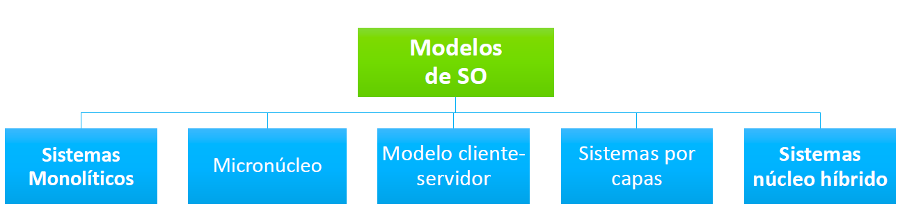
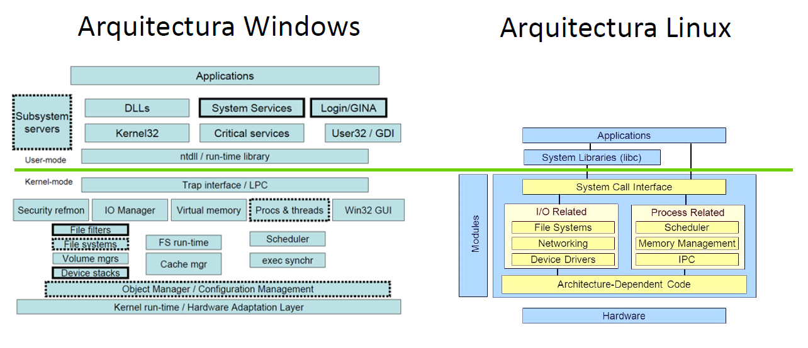

# UT2.1 Estructura de los SO

## Niveles de ejecución de un SO	

- **Nivel 0** - Nivel de Lógica Digital. Se corresponde con el hardware real de la máquina (dispositivos y circuitos electrónicos).

- **Nivel 1**: Microprogramación. Son los comandos que intercambian entre sí los circuitos electrónicos. En este nivel, se encuentran los microprogramas, cuya tarea consiste en interpretar las instrucciones de nivel superior.

- **Nivel 2**: Lenguaje máquina. Es el nivel inferior accesible por el usuario y se corresponde con el conjunto de instrucciones que forman el lenguaje directamente interpretable por el hardware.

- **Nivel 3**: Sistema operativo. Es el conjunto de programas que facilitan la gestión de los recursos del sistema. De esta manera, se crea un entorno favorable para que el usuario interaccione con los niveles inferiores de la máquina.

- **Nivel 4**: Lenguajes de alto nivel. Son lenguajes de programación con alta abstracción del hardware. El programador encuentra un entorno amigable para la codificación de algoritmos.

- **Nivel 5**: Nivel de aplicación. Es el nivel más alejado de la realidad física en el cual el usuario no tiene en cuenta los niveles inferiores.

Tal y como hemos visto para un SO es crítico la **protección de recursos**, para evitar que un usuario acceda a recursos para los que no está autorizado.

Para que la protección de un SO sea posible, el sistema informático debe ser capaz de ejecutar programas e instrucciones en dos niveles de ejecución diferentes:

-   **En modo usuario**: es el modo menos privilegiado de funcionamiento del sistema. En este modo no se permite el acceso directo al *hardware*. Este es el modo de ejecución que utilizan todos los programas de aplicación que tengamos instalados.
    
-   **En modo núcleo (kernel)**: En él, las instrucciones se ejecutan en un *modo privilegiado*, teniendo acceso directo a toda la memoria (incluidos los *espacios de direcciones*de todos los procesos que estén ejecutándose). También podrán acceder a todo el *hardware* disponible. En este modo sólo se ejecutan algunas partes del *SO*.

## Modelos de SO

Los SO pueden tener las siguientes organizaciones (llamada también arquitectura o modelo) para satisfacer las necesidades que de ellos se quieren obtener:

### 1. Sistemas monolíticos

Todo el software y las estructuras de datos están ubicados en un único  modulo lógico, sin interfaces explícitas entre las partes del SO.

Prácticamente, no hay ocultación de la información: cualquier programa puede acceder a cualquier estructura de datos.

Se utilizan porque:

-   Es la estructura más sencilla para SO pequeños

-   Es difícil particionar un SO debido a las muchas interrelaciones entre partes

-   Suelen ser muy eficientes cuando son correctamente implementados

-   Difíciles de mantener y de comprender.

-   Ejemplos típicos de este sistema son:

    -   MS-DOS

    -   **Linux**

    -   Mac OS hasta 8.6

    -   Familia Microsoft Windows 9x

### 2. Micronúcleo

El **micronúcleo** surge como una nueva forma de organización para un SO. Es un     término algo tedioso de entender ya que puede no ser relativo a su tamaño, pero si a su diseño.

Un micronúcleo es un pequeño núcleo del SO que proporciona las bases para ampliaciones modulares

La idea: sólo las funciones absolutamente esenciales del núcleo del SO deben permanecer en el micronúcleo.

Las aplicaciones y los servicios menos esenciales se construyen sobre el micronúcleo y se ejecutan en modo usuario. Por ejemplo: manejadores de dispositivo, sistemas de ficheros, gestores de memoria virtual, etc.

Ejemplo: antiguos UNIX y Mach

### 3. Modelo cliente-servidor	

Se trata de una ligera variación en la idea del micronúcleo en la cual el sistema hace la diferencia entre dos clases de procesos:
- Los servidores, cada uno de los cuales proporciona cierto servicio,
- Los clientes, que utilizan estos servicios.

El núcleo maneja la comunicación entre clientes y servidores, la cual se realiza, habitualmente, intercambiando mensajes.
-   Ejemplos:

    -   Chrome OS

### 4. Sistema por capas	

El SO se construye en capas de niveles jerárquicos, cada uno de los cuales aprovecha los servicios del nivel inferior.

-   Diseño más modular y escalable que el monolítico.

-   mientras que la más alta o

-   Problema: cantidad, orden y contenido de las capas

-   Ventajas:

    -   Modularidad

    -   Ocultación de la información

    -   Verificación capa a capa

-   Ejemplos: MULTICS

### 5. Núcleo híbrido	

Este tipo de arquitectura consiste básicamente en un esquema de micronúcleo que incluye algo de código complementario para hacerlo más rápido, aunque buena parte de las funciones del sistema operativo siguen ejecutándose en modo usuario.

Se trata de una solución de compromiso que han adoptado muchos de los sistemas operativos modernos como Windows o Mac.

Ejemplos:

- Versiones escritorio de **Windows **a partir de XP

- Mac **OSX**.

  

##   Comparativa	

