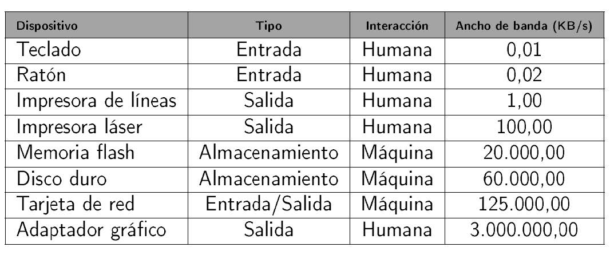
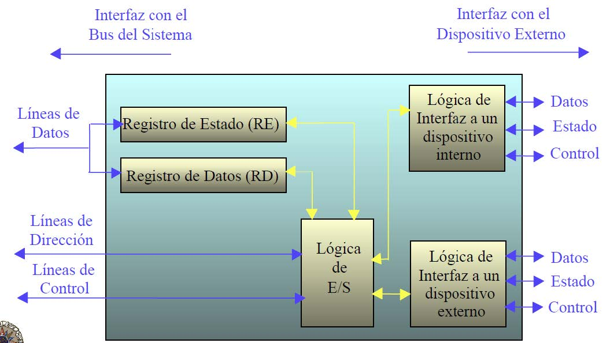
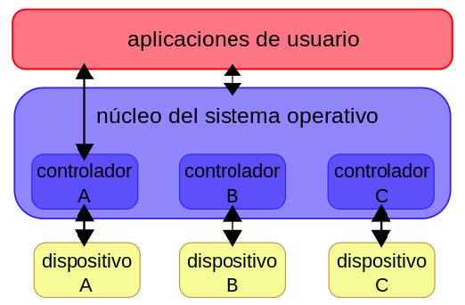
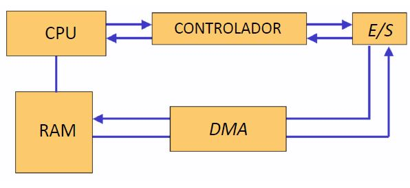

# UT5.1: Gestión de Entrada/Salida

## Sistema de entrada/Salida

>   💡 El sistema de **Entrada/Salida** es la parte del SO encargada de la gestión de los dispositivos de E/S (**periféricos**). Actúa como interfaz entre los dispositivos de E/S y el resto del sistema.

El sistema operativo es el encargado de enviar órdenes y determinar el dispositivo que necesita la atención del procesador al igual que hace con los procesos en memoria, ayudándose para ello de los **drivers**.

El sistema operativo ha de proporcionar a programas y procesos:

-   Comandos que faciliten el uso de los periféricos.
-   Aceptación y tratamiento de **interrupciones**.
-   Gestión de errores.
-   Una interfaz que sea independiente del dispositivo (que no haya que cambiar el programa en el caso de cambiar el dispositivo de entrada/salida).

## Dispositivos de Entrada/Salida

Los dispositivos de E/S se clasifican básicamente en 3 categorías:

 - **Dispositivos legibles por los humanos**:  Son aquellos que están diseñados para mantener comunicación entre la computadora y el usuario.

- **Dispositivos legibles por la maquina**: Son aquellos que mantienen una comunicación con equipos electrónicos.

- **Dispositivos de comunicaciones**:  Son aquellos que están diseñados exclusivamente para mantenerse en comunicación con otros dispositivos a largas distancias.

El SO trata los periféricos según como gestionan estos la información:

- **Periféricos o dispositivos tipo bloque**:
  Son aquellos en los que la información que se maneja es de tamaño fijo. La información entra o sale de memoria en forma de bloques.

  Por ejemplo las unidades de almacenamiento secundario (*hdd, sdd, memorias..)*
  
- **Periféricos o dispositivos tipo carácter**:

  Son los que sirven para introducir datos dentro de la memoria del ordenador en forma de caracteres, sin ningún orden concreto.

  Por ejemplo teclados, ratones o impresoras.

Dentro de toda la gama de dispositivos, existen grandes diferencias que los hacen únicos y especiales dentro de su clase.

-   Velocidad de transmisión de los datos.
-   Aplicaciones: la utilidad que tiene un dispositivo, su conectividad y funcionalidad con un software.
-   Complejidad de control: tipo de interfaz de control del dispositivo.
-   Unidad de Transferencia: tipos de transmisión de datos (flujo de bytes o caracteres).
-   Representación de los datos: tipo de esquema de codificación de datos.
-   Condiciones de error: tipo de error, forma de comunicarlo, y consecuencias.

Cada periférico esta compuesto por un componente mecánico y por otro u otros componentes electrónicos.

El SO se encarga de acceder a la información de la memoria principal, extraerla en forma de impulsos eléctricos y enviarla a los diferentes dispositivos periféricos a través del driver y de su controlador específico.

Si la información se envía a un disco duro, los impulsos se transformaran en señales magnéticas, en un SSD a señales eléctricas, uno óptico en forma de impulsos láser y a una impresora en forma de caracteres.

Recordar que los dispositivos **periféricos** también pueden clasificarse en:

-   Periféricos de **entrada**
-   Periféricos de **salida**
-   Periféricos de **almacenamiento**
-   Periféricos de **comunicación**
-   Periféricos **híbridos**

## Control de E/S

### Control por Hardware

>   💡 La **controladora de periférico** es un componente electrónico **hardware** que controla los periféricos de Entrada/Salida (E/S)

Todos los periféricos tendrán una controladora asociada. Por ejemplo, cuando conectamos un ratón o un teclado, existe un controlador hardware que maneja los puertos USB.

Las controladoras hardware están integradas casi en su totalidad en la placa base. Actualmente, las placas base son muy complejas y aúnan controladoras para los puertos Ethernet, VGA/DVI/HDMI, USB, lector de tarjetas, etc.

Las principales funciones de una controladora de periférico:

-   Control y temporización: los recursos internos (memoria y bus)
-   Comunicación con la CPU
-   Comunicación con el dispositivo externo
-   Almacenamiento temporal de datos
-   Detección de errores

### Control por Software

>   💡 Un **controlador o driver de un dispositivo** es un programa o software proporcionado generalmente por el fabricante de un periférico cuya finalidad es servir de interfaz entre el SO y el hardware de ese dispositivo concreto.

Los controladores o drivers son piezas esencial del software, y en particular, del núcleo o kernel de un sistema operativo, sin la cual el hardware sería inutilizable.

Funciones de un **driver**:

-   Definir las características del dispositivo para el SO y los procesos de usuario.
    
-   Asignar valores iniciales adecuados a los registros asociados al dispositivo en el momento de arranque o encendido del sistema.
    
-   Permitir que un proceso pueda acceder al dispositivo (*OPEN*), o bien retirarle dicho permiso (*CLOSE*).
    
-   Procesar las operaciones de E/S solicitadas por cualquier proceso que tenga permitido el acceso al dispositivo (*READ y WRITE*).
    
-   Cancelar toda operación de E/S en el momento en que sea necesario (*CANCEL*)

-   Procesar las interrupciones hardware generadas por el dispositivo periférico.
    
-   Tratar los errores y estado del dispositivo y comunicárselo al sistema operativo para que este a su vez avise al usuario.

## Técnicas para realizar la E/S

### 1.  Estado operación

El sistema operativo sólo conoce el momento en el que comienza una operación  de entrada/salida, pero no cuando termina. 

Existen dos formas para averiguarlo:

-   **Polling (sondeo):**Consiste en comprobar constantemente el estado del dispositivo. Tiene el inconveniente de ocupar el procesador un tiempo indeseado. Por ejemplo para el ratón el procesador verifica periódicamente su estado; si el usuario lo ha movido se informa al SO para actualizar el puntero.
-   **Interrupciones:**El procesador continúa ejecutando otros procesos y sólo cuando el dispositivo concluya una operación llama la atención del procesador, interrumpiéndole para que tenga un conocimiento de dicha situación y realice las acciones que considere necesarias.

Los tiempos de transacciones de la CPU con la memoria y los dispositivos de E/S son muy diferentes, con lo cual se trabaja con ellos de forma **asíncrona**.

Debido a esa **diferencia de velocidades** entre los dispositivos de E/S y
la CPU:

-   Los dispositivos mas rápidos se conectarán mediante canales especializados utilizando el acceso directo a memoria (DMA)
    
-   Los mas lentos se controlan directamente por la CPU.

>   📌 Hay que tener en cuenta las **conversiones de formato** necesarias entre los periféricos y el sistema; unos dispositivos requieren **transferencias en serie,**otros en **paralelo**, así como las codificaciones necesarias para controlar los errores de transmisión.

### 2.  Transmisión de datos por el canal

Los dispositivos transmiten sus datos (ya sea de tipo bloque o caracteres) a través de los canales (buses) del sistema. Dependiendo del dispositivo que se trate existen dos técnicas de transmisión que evitan que el procesador tenga que esperar mientras se reciben o envían datos desde o hacia el dispositivo:

- **Spooling**: Con dispositivos de salida de acceso muy lentos (como cintas o impresoras) se utiliza la memoria secundaria (disco) donde se graba la información que se utilizará. En el caso de una impresora, por ejemplo, el procesador genera la información grabándola en disco y la impresora recoge la información de disco para imprimirla posteriormente.
  
- **Buffering**: Se utiliza con dispositivos relativamente lentos. Usa una memoria intermedia llamada **buffer** para depositar datos leídos o por grabar, mientras el procesador se ocupa de otra cosa. Una vez lleno el buffer, se producirá una interrupción que avisará al procesador para que recoja la información contenida en el mismo.

En el caso del **buffering** si el dispositivo es muy rápido, puede ser que el procesador no tenga velocidad para tratar toda la información a tiempo, pudiendo provocar un desbordamiento de buffer.

Para resolver este problema se añaden unos dispositivos de hardware especiales llamados **DMA** (*Acceso Directo a Memoria*), cuya misión es permitir la transferencia de información entre la memoria y los dispositivos de E/S sea directa, sin la necesidad de intervenir la CPU.

>   💡 El **acceso directo a memoria o DMA**, permite a ciertos dispositivos de un ordenador acceder a la memoria del sistema para leer o escribir independientemente de la unidad central de procesamiento (CPU).

